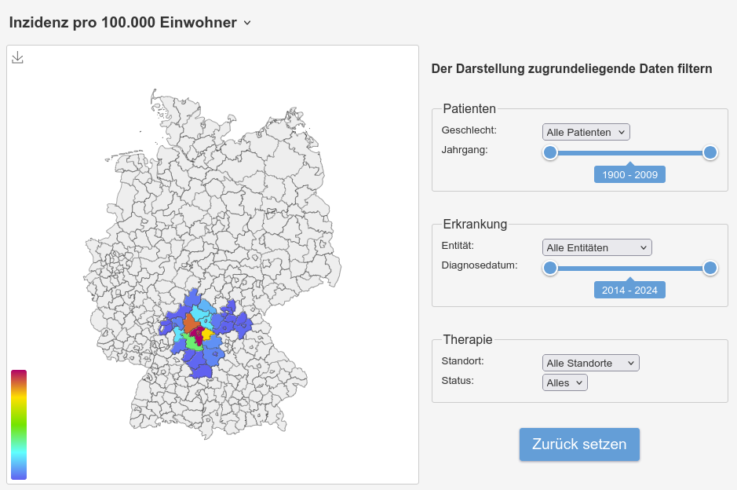
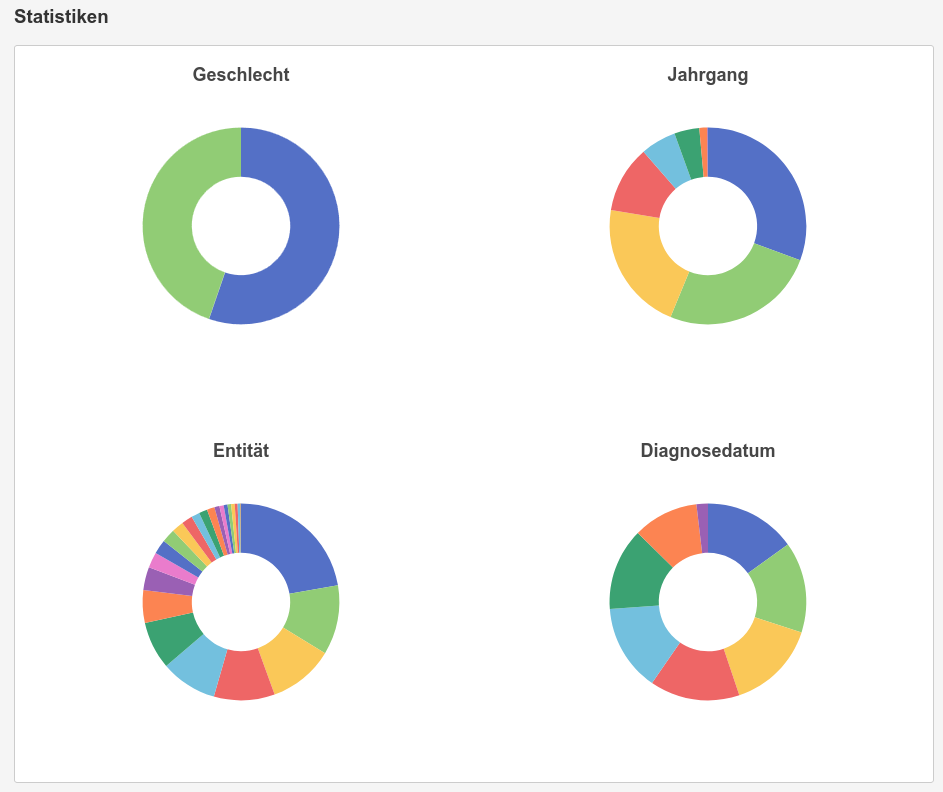

# Concept-Demonstration - Beispiel Studienprotokoll 2023 - Teil C

Vorstellung einer möglichen Benutzeroberfläche für das BZKF Studienprotokoll 2023 - Teil C: "Visuelle Auswertungen".



Zudem werden Diagramme mit Statistiken angezeigt.



## Konfiguration

Über die Umgebungsvariable `LISTENER_ADDRESS` kann die Adresse und der Port festgelegt werden. Standardwert ist
`[::]:3000`.

Die Umgebungsvariable `SAMPLE_DATA_FILE` muss auf eine Datei mit Daten zeigen. Die Datei muss dabei als CSV-Datei
vorliegen und die folgenden Spalten beinhalten:

```
icd10,ags,diagnosis_year,birth_decade,sex,count
```

## Geokoordinaten, -informationen und weitere verwendete Software

Die Angaben zu den Koordinaten eines Kreises wurden
mittels [OpenStreetMap](https://nominatim.openstreetmap.org/ui/search.html) ermittelt.

Die Angaben zur Einwohnerzahl stammen aus
der [Zensus Datenbank](https://ergebnisse.zensus2022.de/datenbank/online/statistic/1000A/table/1000A-0000) mit
Stand 2022.

Verwendetes Kartenmaterial nutzt bearbeitete Informationen des Regionalatlas Deutschland, veröffentlicht unter der
[Datenlizenz Deutschland – Namensnennung – Version 2.0](https://www.govdata.de/dl-de/by-2-0).

Zur Darstellung von Diagrammen wird [Apache ECharts](https://echarts.apache.org/en/index.html) verwendet.